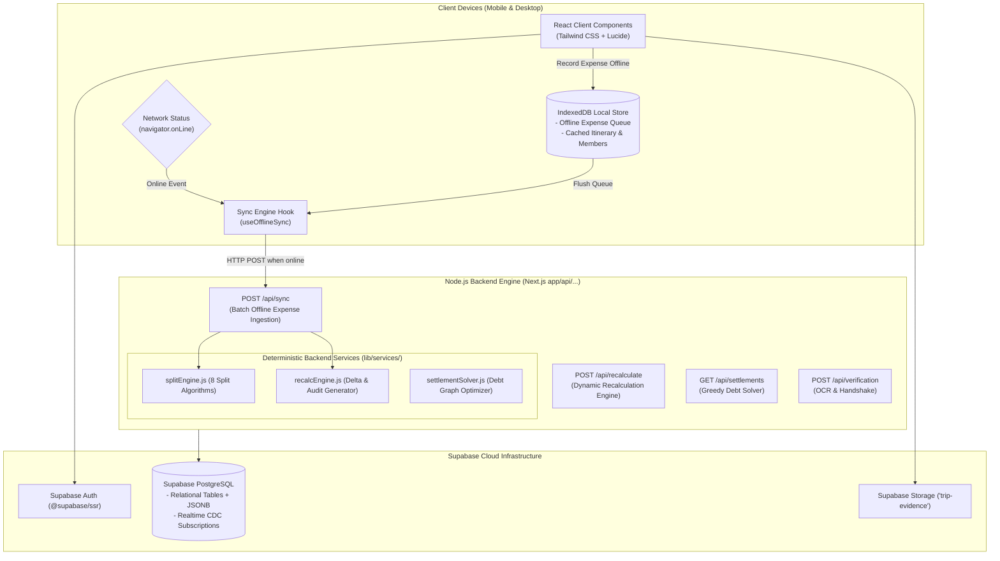
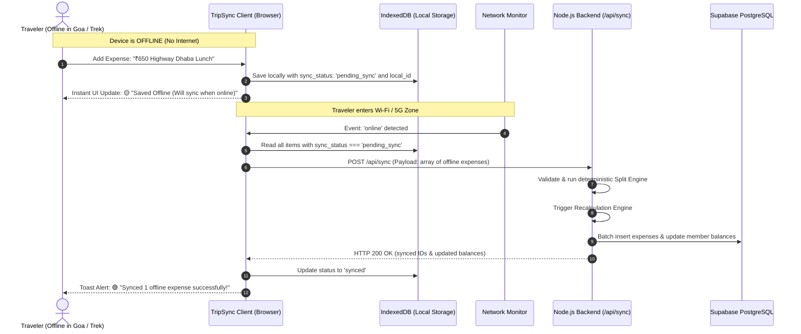
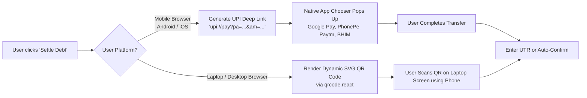

# TripSync — Technical Architecture Specification 🏗️

> **Project Name**: **TripSync**  
> **Tagline**: Living Verified Travel Ledger, Dynamic Group Settlement & Offline Sync  
> **Document Version**: 4.0 (Offline-First Architecture + Next.js Node.js Backend + Supabase)  

---

## 1. High-Level Architecture Diagram



---

## 2. Offline-First Sync Architecture

Traveling often involves mountain passes, flights, beaches, or remote highways with zero internet. TripSync guarantees that travelers can continue recording expenses without interruption.



### 2.1 IndexedDB Schema (Client-Side)
Using `idb-keyval` or lightweight Dexie wrapper:
```typescript
interface IOfflineExpense {
  localId: string; // Client-generated UUID (e.g., 'local_1727339000')
  tripId: string;
  title: string;
  category: string;
  totalAmount: number;
  paidByMemberId: string;
  splitMethod: string;
  allocations: { memberId: string; shareAmount: number }[];
  proofType: 'upi_screenshot' | 'bill_receipt' | 'no_proof';
  proofBase64?: string; // Stored locally until uploaded
  createdAt: string; // ISO timestamp
  syncStatus: 'pending_sync' | 'syncing' | 'synced';
}
```

### 2.2 Conflict Resolution Strategy
* **Client-Assigned Timestamps**: Offline expenses retain their actual creation timestamp (`createdAt`), preventing chronological distortion when synced later.
* **Deterministic Recalculation Order**: Synced batches are processed chronologically on the server, guaranteeing that balances accurately reflect the timeline of the trip.

---

## 3. The Backend Layer (Node.js)

The backend is built with **Node.js** inside Next.js Route Handlers (`app/api/*`):
* **Runtime**: Node.js (v18+)
* **Database Driver**: `@supabase/supabase-js` (with Service Role Key for server-only operations)
* **Endpoints**:
  * `POST /api/trips`: Create trip with governance mode (`manager_based` or `democratic`) and generate invite code.
  * `POST /api/trips/[id]/join`: Join trip using invite code.
  * `POST /api/bookings`: Create itinerary item and link participant roster.
  * `POST /api/expenses`: Record expense and calculate 8-way splits.
  * `POST /api/sync`: **Batch sync endpoint for offline expenses.**
  * `POST /api/recalculate`: Recalculation engine on member leave/refund.
  * `GET /api/settlements`: Compute greedy debt transfers and explainability tree.
  * `POST /api/verification`: OCR parsing and cash handshake verification.

---

## 4. Supabase PostgreSQL Schema

```sql
-- 1. Profiles Table (Extends auth.users)
CREATE TABLE public.profiles (
  id UUID REFERENCES auth.users(id) ON DELETE CASCADE PRIMARY KEY,
  full_name TEXT NOT NULL,
  phone TEXT,
  upi_id TEXT, -- e.g., 'rahul@oksbi'
  avatar_url TEXT,
  created_at TIMESTAMPTZ DEFAULT NOW(),
  updated_at TIMESTAMPTZ DEFAULT NOW()
);

-- 2. Trips Table
CREATE TYPE trip_governance_mode AS ENUM ('manager_based', 'democratic');
CREATE TYPE trip_status AS ENUM ('planning', 'ongoing', 'completed', 'archived');

CREATE TABLE public.trips (
  id UUID PRIMARY KEY DEFAULT gen_random_uuid(),
  title TEXT NOT NULL,
  destination TEXT NOT NULL,
  start_date DATE NOT NULL,
  end_date DATE NOT NULL,
  description TEXT,
  cover_image TEXT,
  governance_mode trip_governance_mode DEFAULT 'manager_based',
  invite_code TEXT UNIQUE NOT NULL,
  status trip_status DEFAULT 'planning',
  created_by UUID REFERENCES public.profiles(id) ON DELETE RESTRICT,
  created_at TIMESTAMPTZ DEFAULT NOW(),
  updated_at TIMESTAMPTZ DEFAULT NOW()
);

-- 3. Trip Members Table (Trip-scoped RBAC)
CREATE TYPE member_role AS ENUM ('owner', 'manager', 'participant');
CREATE TYPE member_status AS ENUM ('active', 'left', 'removed');

CREATE TABLE public.trip_members (
  id UUID PRIMARY KEY DEFAULT gen_random_uuid(),
  trip_id UUID REFERENCES public.trips(id) ON DELETE CASCADE,
  user_id UUID REFERENCES public.profiles(id) ON DELETE CASCADE,
  role member_role DEFAULT 'participant',
  display_name TEXT NOT NULL,
  upi_id TEXT,
  status member_status DEFAULT 'active',
  left_at TIMESTAMPTZ,
  reason_for_leaving TEXT,
  joined_at TIMESTAMPTZ DEFAULT NOW(),
  UNIQUE(trip_id, user_id)
);

-- 4. Bookings Table (Linked to itinerary & finances)
CREATE TYPE booking_category AS ENUM ('hotel', 'flight', 'train', 'bus', 'cab', 'activity', 'meal', 'other');
CREATE TYPE booking_status AS ENUM ('confirmed', 'modified', 'cancelled', 'refunded');

CREATE TABLE public.bookings (
  id UUID PRIMARY KEY DEFAULT gen_random_uuid(),
  trip_id UUID REFERENCES public.trips(id) ON DELETE CASCADE,
  title TEXT NOT NULL,
  category booking_category NOT NULL,
  vendor_name TEXT NOT NULL,
  booking_reference TEXT,
  start_time TIMESTAMPTZ NOT NULL,
  end_time TIMESTAMPTZ,
  location TEXT,
  original_cost NUMERIC(12, 2) NOT NULL,
  current_cost NUMERIC(12, 2) NOT NULL,
  refund_amount NUMERIC(12, 2) DEFAULT 0.00,
  currency TEXT DEFAULT 'INR',
  status booking_status DEFAULT 'confirmed',
  paid_by_member_id UUID REFERENCES public.trip_members(id),
  participant_member_ids UUID[] NOT NULL,
  split_method TEXT DEFAULT 'equal',
  cancellation_policy TEXT,
  created_at TIMESTAMPTZ DEFAULT NOW(),
  updated_at TIMESTAMPTZ DEFAULT NOW()
);

-- 5. Expenses Table (Dynamic allocations in JSONB)
CREATE TYPE expense_verification_status AS ENUM ('draft', 'pending_verification', 'verified', 'disputed', 'rejected');
CREATE TYPE proof_type_enum AS ENUM ('upi_screenshot', 'bill_receipt', 'no_proof');

CREATE TABLE public.expenses (
  id UUID PRIMARY KEY DEFAULT gen_random_uuid(),
  trip_id UUID REFERENCES public.trips(id) ON DELETE CASCADE,
  booking_id UUID REFERENCES public.bookings(id) ON DELETE SET NULL,
  title TEXT NOT NULL,
  category TEXT NOT NULL,
  total_amount NUMERIC(12, 2) NOT NULL,
  paid_by_member_id UUID REFERENCES public.trip_members(id),
  date DATE NOT NULL DEFAULT CURRENT_DATE,
  split_method TEXT NOT NULL,
  allocations JSONB NOT NULL,
  verification_status expense_verification_status DEFAULT 'pending_verification',
  proof_type proof_type_enum NOT NULL,
  proof_url TEXT,
  extracted_details JSONB,
  mismatch_flag BOOLEAN DEFAULT FALSE,
  mismatch_reason TEXT,
  verified_by UUID REFERENCES public.trip_members(id),
  verified_at TIMESTAMPTZ,
  local_offline_id TEXT, -- Tracks original offline ID to prevent duplicates
  created_at TIMESTAMPTZ DEFAULT NOW(),
  updated_at TIMESTAMPTZ DEFAULT NOW()
);

-- 6. Ledger Audit Logs (Powers "What Changed?")
CREATE TABLE public.ledger_audit_logs (
  id UUID PRIMARY KEY DEFAULT gen_random_uuid(),
  trip_id UUID REFERENCES public.trips(id) ON DELETE CASCADE,
  trigger_event TEXT NOT NULL,
  description TEXT NOT NULL,
  affected_booking_id UUID REFERENCES public.bookings(id) ON DELETE SET NULL,
  affected_member_id UUID REFERENCES public.trip_members(id) ON DELETE SET NULL,
  snapshot_before JSONB NOT NULL,
  snapshot_after JSONB NOT NULL,
  impact_summary TEXT NOT NULL,
  performed_by UUID REFERENCES public.trip_members(id),
  created_at TIMESTAMPTZ DEFAULT NOW()
);

-- 7. Chat Messages & Polls
CREATE TYPE message_type_enum AS ENUM ('text', 'expense_alert', 'poll', 'system_audit');

CREATE TABLE public.chat_messages (
  id UUID PRIMARY KEY DEFAULT gen_random_uuid(),
  trip_id UUID REFERENCES public.trips(id) ON DELETE CASCADE,
  sender_id UUID REFERENCES public.trip_members(id) ON DELETE SET NULL,
  message_type message_type_enum DEFAULT 'text',
  content TEXT NOT NULL,
  attachment_url TEXT,
  expense_id UUID REFERENCES public.expenses(id) ON DELETE CASCADE,
  poll_data JSONB,
  created_at TIMESTAMPTZ DEFAULT NOW()
);

-- 8. Settlements Table
CREATE TYPE payment_method_enum AS ENUM ('upi_intent', 'upi_qr', 'cash');
CREATE TYPE settlement_status_enum AS ENUM ('pending', 'verifying', 'completed', 'disputed');

CREATE TABLE public.settlements (
  id UUID PRIMARY KEY DEFAULT gen_random_uuid(),
  trip_id UUID REFERENCES public.trips(id) ON DELETE CASCADE,
  payer_member_id UUID REFERENCES public.trip_members(id),
  receiver_member_id UUID REFERENCES public.trip_members(id),
  amount NUMERIC(12, 2) NOT NULL,
  payment_method payment_method_enum DEFAULT 'upi_intent',
  status settlement_status_enum DEFAULT 'pending',
  utr_number TEXT,
  breakdown_summary JSONB NOT NULL,
  receiver_confirmed_at TIMESTAMPTZ,
  created_at TIMESTAMPTZ DEFAULT NOW(),
  updated_at TIMESTAMPTZ DEFAULT NOW()
);
```

---

## 5. Device-Adaptive Payment Architecture


