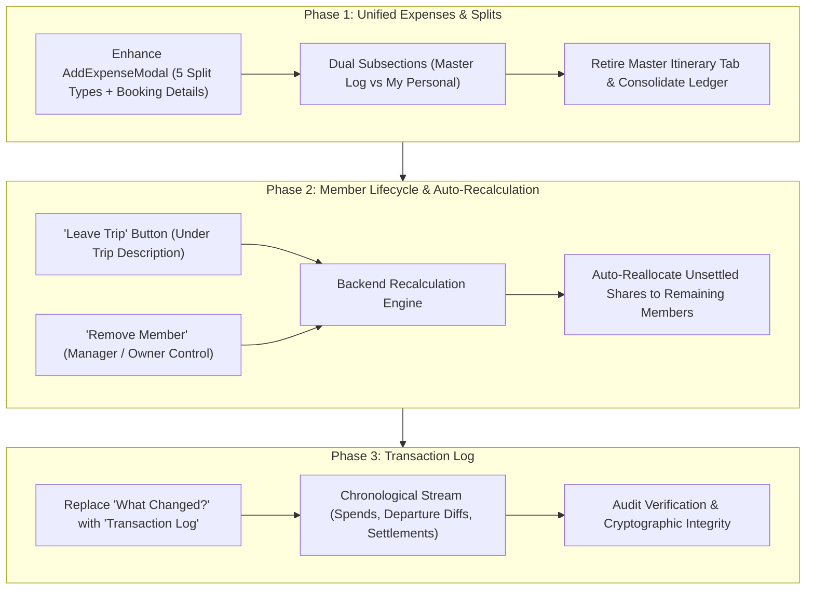

# 🏛️ TripSync: Unified Expenses, Member Lifecycle & Transaction Log Architecture

> **Document**: Merge & Modernization Architecture Specification  
> **Target Scope**: Consolidate Itinerary & Expenses, Add Self-Leave / Removal with Auto-Recalculation, and Replace "What Changed?" with a Comprehensive "Transaction Log".

---

## 📌 Executive Summary

This architecture plan unifies the group travel ledger into a cohesive, dispute-free experience split into **3 clean, executable phases**:

1. **Unified Expenses & Splits**: Combines Master Itinerary and Expenses into a single master ledger with 5 split algorithms (Equal, Activity, Percentage, Shares, Exact) and dual view filters (**Master Log** vs. **My Personal**).
2. **Member Lifecycle & Auto-Recalculation**: Introduces "Leave Trip" for participants and "Remove Member" for managers, automatically triggering the backend recalculation engine to adjust liabilities for remaining active members.
3. **Transaction Log**: Replaces the former "What Changed?" section with a chronological, tamper-evident **Transaction Log** tracking all expenses, split adjustments, departures, and settlements.

---

## 🚀 Phase-by-Phase Roadmap

### 🔹 Phase 1: Unified Expenses & Splits with Subsections

#### Objectives:
- Eliminate redundant forms between Itinerary Bookings and Expenses.
- Bring the full 5-way deterministic split engine into the expense workflow.
- Provide clear views for group-wide vs. personal transactions.

#### Key Deliverables:
1. **Enhanced `AddExpenseModal`**:
   - **Split Methods Selector**:
     - ⚖️ Equal Split (`equal`)
     - 🎯 Activity-Based / Selective Travelers (`activity_based`)
     - 📊 Percentage Split (`percentage`) with custom % per member
     - 🔢 Shares Split (`shares`) with custom weights (1x, 2x, etc.)
     - 💵 Exact Amounts (`exact`) with explicit ₹ per person
   - **Live Split Preview**: Instant mathematical breakdown before submission.
   - **Optional Travel / Booking Details Accordion**:
     - Vendor Name (e.g., MakeMyTrip, Airbnb, IndiGo)
     - Booking Confirmation Reference / PNR
     - Activity / Travel Date & Time
   - Preserves OCR Receipt & UPI Screenshot Scanning + AI Natural Language Quick Add.

2. **Dual-View Subsections in Expenses**:
   - 🌐 **Master Log**: Complete, transparent record of all group bookings, meals, stays, and ad-hoc expenses with live status indicators.
   - 👤 **My Personal**: Filtered strictly to transactions where the logged-in user is involved:
     - Expenses they paid/fronted for others (Creditor view).
     - Expenses where they owe a share (Debtor view).

3. **Tab Consolidation**:
   - Merge `MasterItineraryView` capabilities into the newly enhanced `ExpensesView`.
   - Remove the separate "Master Itinerary" tab from `app/trips/[id]/page.jsx`.

---

### 🔹 Phase 2: Member Lifecycle & Backend Auto-Recalculation

#### Objectives:
- Allow travelers to depart a trip cleanly and empower managers to govern participants.
- Automate fair recalculation of shared costs without manual organizer spreadsheet math.

#### Key Deliverables:
1. **Self-Service "Leave Trip"**:
   - A dedicated **"Leave Trip"** button positioned right below the trip description header.
   - Available to active participants across both **Democratic** and **Manager-based** trips.
   - Confirmation dialog warning about balance settlement requirements.

2. **Manager-Governed "Remove Participant"**:
   - For **Manager-based** trips only: Trip Owner and Manager roles get a "Remove Participant" action on participant list items.

3. **Automated Backend Recalculation Engine**:
   - Endpoint: `POST /api/trips/[id]/members/[memberId]/leave` (or member status patch).
   - Status transitions to `left` or `removed`.
   - **Recalculation Execution**:
     - Scans all active shared bookings/expenses where the departed member was a participant.
     - Reallocates liabilities across remaining active travelers using original split ratios.
     - Computes a deterministic Before vs. After balance snapshot diff.
     - Emits an immutable audit log entry detailing exactly how much each remaining traveler's share changed.

---

### 🔹 Phase 3: "Transaction Log" (Replacing "What Changed?")

#### Objectives:
- Replace the legacy "What Changed?" departure-only simulator with a comprehensive, unified **Transaction Log**.
- Give all travelers a transparent, verifiable timeline of every financial event.

#### Key Deliverables:
1. **New Component `TransactionLogView.jsx`**:
   - Chronological unified feed covering 3 key event types:
     1. 💳 **Expense & Booking Additions**: Who paid, total amount, category, split type, and participant list.
     2. 🔄 **Recalculation & Departure Adjustments**: When a member leaves/is removed, displays the exact diff: *"Aman left trip &rarr; Hotel share adjusted: +₹500 for Devesh, +₹500 for Priya"*.
     3. 💸 **Settlements & UPI Transfers**: Confirmation of payments marked settled.
   - Search & Filter by participant, event category, or date.

2. **Audit Hash Integrity**:
   - Keeps tamper-evident SHA-256 integrity hashes for each log entry to ensure absolute financial trust.

3. **Navigation & Clean Up**:
   - Replace the `diff` ("What Changed?") tab with `activity` / `log` ("Transaction Log") tab in `app/trips/[id]/page.jsx`.
   - Safely remove `WhatChangedDiffView.jsx`.

---

## 📊 Summary of Final Navigation Structure

After all 3 phases are complete, the trip interface will have a streamlined, cohesive layout:

| Tab | Name | Purpose |
| :--- | :--- | :--- |
| 1 | **Overview & Members** | Trip details, leave trip button, participant list & live net balances |
| 2 | **My Dashboard** | Personal financial summary, pending debts, items to pay |
| 3 | **Expenses & Splits** | **Master Log** & **My Personal** subsections with 5-way split & booking details |
| 4 | **Transaction Log** | Chronological record of all spends, recalculation diffs, and settlements |
| 5 | **Chat & Polls** | In-trip group chat & democratic voting polls |
| 6 | **Verification** | Manager / Poll verification queue for receipts and UPI proofs |
| 7 | **Settlement & UPI** | Greedy debt simplification & one-tap mobile UPI payments |
| 8 | **Financial Health** | Visual charts (spend by category, member contributions) |

---

## 🚦 Execution Plan
- [ ] **Phase 1**: Enhance `AddExpenseModal` (5 split types + optional booking fields), implement Master Log & My Personal subsections, merge itinerary.
- [ ] **Phase 2**: Add "Leave Trip" and "Remove Member" with automatic backend recalculation on departure.
- [ ] **Phase 3**: Build `TransactionLogView`, connect all event logging, retire "What Changed?".
