# TripSync — Phase-Wise Implementation Roadmap 🗺️

> **Project**: **TripSync** (Next.js Node.js Backend + Supabase + Offline-First Sync)  
> **Execution Protocol**: Each phase is self-contained with clear deliverables, verification criteria, and demo impact. Implementation of each phase will be triggered sequentially only upon user confirmation.

---

## 📅 Roadmap Overview

```mermaid
flowchart LR
    P1["Phase 1: Next.js Foundation & Dual Governance"] --> P2["Phase 2: Master Itinerary & Split Engine"]
    P2 --> P3["Phase 3: Recalculation Core & 'What Changed?'"]
    P3 --> P4["Phase 4: Offline-First Sync & Multi-Tier Verification"]
    P4 --> P5["Phase 5: Smart Settlement & UPI Intent/QR"]
    P5 --> P6["Phase 6: Dashboards & What-If Simulator"]
    P6 --> P7["Phase 7: AI Assistant & Natural Language Capture"]
    P7 --> P8["Phase 8: Demo Seed Data & Final Presentation"]
```

---

## 📌 Phase 1: Next.js Foundation, Supabase Setup & Dual Governance
**Focus**: Project workspace setup, Supabase database schema & storage buckets, authentication, trip creation with dual governance modes, trip join code/link, and trip-scoped RBAC.

### Deliverables:
1. **Next.js & Supabase Foundation**:
   - Next.js (App Router) project initialized with Tailwind CSS, Lucide icons, and `@supabase/ssr`.
   - `sql/schema.sql`: Full PostgreSQL schema ready to run in Supabase SQL editor.
   - Node.js Route Handlers setup (`app/api/trips`, etc.).
2. **Identity & Auth**:
   - User Registration, Login, Session handling with Supabase Auth.
   - Profile management with default settlement UPI ID (`rahul@oksbi`).
3. **Trip & Membership Core**:
   - Trip Creation supporting:
     - 🛡️ **Manager-Based Mode** (Centralized authority).
     - 🗳️ **Group-Members Based (Democratic) Mode** (Flat permissions).
   - Unique alphanumeric Invite Code generation (e.g. `GOA2026`) and join link.
   - Trip-scoped roles: `Trip Owner`, `Trip Manager`, `Participant`.
4. **Verification Criteria**:
   - Run SQL schema in Supabase.
   - Register 2 test users (Organizer Rahul, Member Amit).
   - Create a Manager-Based Trip and a Democratic Trip.
   - Join trip using invite code; verify roles and permissions.

---

## 📌 Phase 2: Master & Personal Itinerary, Bookings & 8-Way Split Engine
**Focus**: Bookings and itinerary management linked to participants and financial allocations, with 8 deterministic split algorithms.

### Deliverables:
1. **Master Itinerary & Booking Management**:
   - Itinerary CRUD (Hotels, Flights, Trains, Cabs, Activities).
   - Vendor tagging, booking reference, cost, fronted payer, and participants roster.
2. **Personal Itinerary View**:
   - Filtered view showing each participant only the bookings/activities they are enrolled in.
3. **The 8-Way Split Engine (`lib/services/splitEngine.js`)**:
   - Equal Split, Participant-Based Split, Exact Amounts, Percentage Split, Shares-Based Split, Room-Occupancy Split, Activity-Based Split, Custom Adjustments with base balancing.
4. **Financial Ledger Aggregator**:
   - Computes individual paid vs. individual share liability in real-time.
5. **Verification Criteria**:
   - Create ₹25,000 Villa booking for 5 members (₹5,000 each).
   - Create ₹12,000 Scuba Diving booking for 4 members (₹3,000 each).
   - Verify master itinerary shows full schedule; individual personal itinerary shows only their enrolled events.

---

## 📌 Phase 3: The Recalculation Engine & "What Changed?" Visual Diff
**Focus**: The core differentiator of TripSync—dynamic backend recalculation upon participant or itinerary changes, with audit logging and visual explanations.

### Deliverables:
1. **Participant Join / Leave Handler (`lib/services/recalcEngine.js`)**:
   - When a participant leaves a trip or cancels out of an activity:
     - Automatically find all affected active bookings and expenses.
     - Remove the member from the allocation rosters.
     - Deterministically recalculate remaining participants' shares.
     - Adjust for cancellations/refunds.
2. **Ledger Audit Log Generator**:
   - Stores `snapshot_before`, `snapshot_after`, and `impact_summary`.
3. **"What Changed?" Visual UI Component**:
   - Side-by-side diff cards:
     - `BEFORE`: Hotel ₹18,000 / 6 people = ₹3,000/person
     - `CHANGE`: Rahul leaves the trip
     - `AFTER`: Hotel ₹18,000 / 5 people = ₹3,600/person
     - `IMPACT`: Remaining 5 participants: +₹600 each.
4. **Verification Criteria**:
   - Have 1 member leave the Goa trip.
   - Confirm backend recalculates balances without manual updates.
   - Verify "What Changed?" component renders the exact financial delta.

---

## 📌 Phase 4: Offline-First Sync & Multi-Tier Verification Pipeline
**Focus**: Full offline recording via IndexedDB with automatic background sync, plus authenticity verification for UPI, Cash, and No-Proof chat polls.

### Deliverables:
1. **Offline-First Storage & Background Sync**:
   - IndexedDB local queue for storing expenses when `navigator.onLine === false`.
   - `useOfflineSync` hook listening for network reconnects.
   - `POST /api/sync`: Batch ingestion endpoint that flushes offline queues into the backend ledger and updates balances.
   - UI status indicators: 🟡 "Saved Offline" badge and 🟢 "Synced" alert.
2. **Quick Expense Capture & Proof Upload**:
   - Screenshot / receipt file upload to Supabase Storage (`trip-evidence`).
   - OCR parser extracting amount, vendor, date, and reference ID.
   - Automatic mismatch detection (Entered amount vs. Evidence amount).
3. **Cash Handshake Verification**:
   - Recipient dashboard shows "Confirm Cash Received" button.
   - Two-way verification updates status from `PENDING` to `VERIFIED`.
4. **Trip Chat & Interactive In-Chat Polls (Supabase Realtime)**:
   - When an expense has **No Proof**:
     - *In Manager Mode*: Routed to Manager/Owner approval queue.
     - *In Democratic Mode*: Auto-publishes an interactive poll into the Trip Chat where group members cast approval votes in real-time.
5. **Verification Criteria**:
   - Simulate offline mode in Chrome DevTools: Add expense -> verify it saves in IndexedDB.
   - Re-enable network -> verify expense auto-syncs to Supabase and updates balances.
   - Submit no-proof expense in Democratic trip -> verify interactive poll is posted in chat.

---

## 📌 Phase 5: Smart Settlement, Explainability & Device-Adaptive UPI Flow
**Focus**: Debt minimization, line-item explainability, and mobile UPI app popup vs. desktop dynamic QR code.

### Deliverables:
1. **Greedy Debt Minimization Engine (`lib/services/settlementSolver.js`)**:
   - Solves net creditor/debtor graph to minimize total group transfers.
2. **Explainable Settlement Breakdown**:
   - Expandable breakdown answering *"Why do I owe ₹X?"* itemized by Hotel, Dinner, Scuba, etc.
3. **Device-Adaptive Payment Flow**:
   - **Mobile Web (Android/iOS)**: Direct `upi://pay?pa={vpa}&pn={name}&am={amount}&tn={note}&cu=INR` intent link launching native app picker (GPay, PhonePe, Paytm, BHIM).
   - **Desktop / Laptop Web**: Dynamic SVG QR code generated with the recipient's UPI VPA and exact amount.
4. **Payment Status Lifecycle**:
   - `PENDING → VERIFYING → PAID / DISPUTED` with transaction UTR submission.
5. **Verification Criteria**:
   - Generate settlement between Amit and Rahul.
   - Click "Settle Up": On desktop verify QR code renders; on mobile simulate UPI intent launch.
   - Verify explainability tree lists exact bookings and expenses.

---

## 📌 Phase 6: Dashboards, Financial Health & "What-If" Simulator
**Focus**: Personal finance dashboard, organizer health overview with visual charts, and a what-if simulation sandbox.

### Deliverables:
1. **Personal Dashboard**:
   - "What do I owe?" & "Why do I owe it?"
   - My personal itinerary schedule, paid expenses, and pending dues.
2. **Organizer / Group Financial Health Dashboard**:
   - Total trip cost, category-wise breakdown (Recharts donut/bar charts), paid vs. pending balances, unverified expense alerts.
3. **"What-If" Financial Simulation Sandbox**:
   - Real-time simulation of recalculated liabilities without modifying the active ledger.
4. **Verification Criteria**:
   - View category breakdown charts.
   - Run simulation and verify sandbox results compare cleanly against the live ledger.

---

## 📌 Phase 7: AI Finance Assistant & Natural Language Expense Entry
**Focus**: Conversational finance assistant and natural language expense logging.

### Deliverables:
1. **Natural Language Expense Parser**:
   - Converts *"I paid ₹1800 for lunch for me, Amit and Priya"* into a structured draft expense.
2. **AI Finance Explainer**:
   - Answers questions like *"Why does Priya owe ₹1,400?"* or *"What changed after Rahul left?"*
3. **Verification Criteria**:
   - Input voice/text prompt and observe auto-filled expense modal.
   - Ask AI assistant questions about ledger state.

---

## 📌 Phase 8: Demo Seed Data, End-to-End Walkthrough & Polish
**Focus**: Complete end-to-end integration, demo seed script ("Goa Adventure 2026"), responsive UI polish, and hackathon presentation readiness.

### Deliverables:
1. **One-Click Demo Seed Script**:
   - Seeds 5 pre-configured users (Rahul, Amit, Priya, Sneha, Vikram).
   - Seeds "Goa Adventure 2026" trip with mixed bookings, expenses, receipts, and chat history.
2. **14-Step Master Hackathon Walkthrough Script**:
   - Guided walkthrough verifying all judge criteria within 4 minutes.
3. **UI Polish**:
   - Micro-interactions, status badges, toast notifications, responsive mobile views.
4. **Verification Criteria**:
   - Execute `npm run seed` -> Launch frontend -> Run 14-step presentation flawlessly.

---

## 🚦 Execution Protocol
Whenever you say:
- **"Start Phase 1"** (or specify any phase), we will immediately implement that exact phase, verify it thoroughly, and provide a clear status report before moving to the next.
