# ✈️ TripSync — Living Verified Travel Ledger & Coordination Platform

> **Multi-Vendor Group Travel Coordination, Dynamic Financial Recalculation, Weather Digital Twin & Adaptive UPI Settlement**  
> *Built with Next.js 14 (App Router), Tailwind CSS, Supabase PostgreSQL, Google Gemini Vision, Groq AI, and NuGen Intelligence.*

---

## 🌟 Executive Overview

Group travel—whether with friends, families, college clubs, or corporate teams—is inherently dynamic and messy. Itineraries get delayed, activities get cancelled by adverse weather, travelers drop out last minute, and receipts get lost. Traditional expense splitters (like Splitwise or Excel) are passive calculators: they cannot track multi-vendor itinerary bookings, cannot model weather disruptions, cannot audit who skipped what, and fail when group dynamics change mid-trip.

**TripSync** transforms group travel into a **Living, Verified Financial Ledger**. It bridges the entire travel lifecycle:
$$\text{Trip Creation} \longrightarrow \text{Multi-Vendor Bookings} \longrightarrow \text{Weather Digital Twin} \longrightarrow \text{Dynamic Recalculations} \longrightarrow \text{Verification Queue} \longrightarrow \text{Greedy UPI Settlement}$$

---

## 🚀 Key Innovations & What's New

### 1. 🌪️ Weather Digital Twin & Disruption Simulator
* **Live Environmental Telemetry**: Real-time sensor metrics via Open-Meteo API (precipitation, rain intensity, wind speed, wind gusts, weather severity, and WMO codes).
* **Interactive Satellite Map**: Built with **Leaflet**, displaying geo-referenced pins of all trip locations (villas, dining lawns, marine diving points, highway transit corridors).
* **Interactive What-If Simulation Slider**: Real-time modeling of severe weather disruptions (rainfall up to 100 mm/h, wind gusts up to 80 km/h, and flood risks).
* **Cascading Ripple-Effect Engine**: Computes higher-order impacts (e.g., marine dive bans triggering 100% force-majeure refunds; highway waterlogging triggering a 1.8x cab surge multiplier; open-air lawn dining moving indoors).
* **Live Media Wire & Social Pulse**: Ingests real-world live headlines via Google News RSS alongside reactive Twitter/Reddit sentiment signals for situational awareness.
* **NuGen Intelligence v3 Integration**: Aligned on the `llama-v3p2-3b-reasoning` base model and `glm-5p2` deployment for domain-specific travel disruption analysis.

### 2. ⚡ Sub-2s Single-Shot Vision OCR & Fast AI Expense Parser
* **Single-Shot Multimodal OCR**: Powered by **Google Gemini Vision** (`gemini-flash-lite-latest` / `gemini-3.1-flash-lite-preview`). In one pass (~1.5s), it transcribes raw receipt/UPI text and extracts structured JSON parameters (`title`, `category`, `totalAmount`, `utr`, `payer`, `participants`, `proofType`).
* **Client-Side Canvas Compression**: Automatically resizes 5MB–10MB mobile phone photos to max 1200px before uploading, shrinking payloads to ~150KB and cutting latency by 90%.
* **Instant Demo Samples**: One-click simulated GPay UPI screenshot and restaurant tax bill receipt for frictionless testing.
* **Sub-300ms Natural Language Parser**: Powered by **Groq AI** (`qwen/qwen3.8-27b`) with Gemini fallback for conversational entry (e.g., *"Paid 1800 for dinner at Thalassa for me and Vikram"*).

### 3. 🔄 Dynamic Recalculation Engine ("What Changed?")
* **Immutable Snapshot Auditing**: Automatically captures `snapshot_before` and `snapshot_after` whenever members leave, skip an activity, or receive vendor refunds.
* **Liability Lock Policy**: When a traveler leaves or is excused from an activity, their pre-committed liability is locked and payable, guaranteeing that remaining travelers incur **₹0 loss**.
* **Visual Delta Breakdown**: Displays exact line-item impact summaries (e.g., *"Vikram's predecided share (₹2,400) is locked and payable. Remaining 4 travelers incur ₹0 loss"*).

### 4. ⚖️ Dual Governance Architecture
* 🛡️ **Manager-Based Mode**: Centralized authority. Trip Owner and designated Managers approve itinerary bookings, remove participants, and verify high-value expenses.
* 🗳️ **Democratic Mode**: Flat group hierarchy. Expenses without receipts trigger interactive WhatsApp-style in-chat polls with quorum-based voting.

### 5. 💳 Device-Adaptive UPI Settlement & Greedy Minimization
* **Greedy Debt Minimization Solver**: Simplifies complex $N$-party debts into minimal optimal bilateral transfers ($K \le N - 1$).
* **Device Detection**:
  * **📱 Mobile**: One-tap deep link (`upi://pay?pa=...&pn=...&am=...`) directly launching Google Pay, PhonePe, Paytm, or BHIM.
  * **💻 Desktop**: High-resolution dynamic SVG QR code (`qrcode.react`) with pre-filled VPA and amount for instant scanning.
* **Explainability Tree**: Drill down into any transfer to view the exact ground-truth balance math: $\text{Net Balance} = \text{Total Fronted} - \text{Itemized Liabilities}$.
* **Handshake Verification & Confetti**: Creditors confirm received transfers, triggering a celebratory full-screen confetti burst (`canvas-confetti`).

### 6. 👤 Personal Traveler Dashboard
* Individualized traveler view filtering personal enrolled bookings, upcoming schedules, fronted expenses, personal liability share, and debt settlement status.

### 7. 💸 Dedicated Refunds Hub
* Tracks vendor refunds, cancellation chargebacks, and Force Majeure returns with proportional ledger reimbursement for both specific travelers and whole-group bookings.

---

## 🏗️ System Architecture

```mermaid
flowchart TD
    subgraph Frontend["Frontend Layer (Next.js 14 + Tailwind)"]
        UI["Trip Hub (Dark Red/Gold Luxury Theme)"]
        Tabs["9 Core Tabs: Overview, Digital Twin, Personal, Expenses, Logs, Refunds, Chat, Settle, Health"]
        Canvas["HTML5 Canvas Image Compressor"]
        Map["Leaflet Interactive Satellite Map"]
        Copilot["AI Finance Copilot Modal"]
    end

    subgraph AppRouter["Next.js Route Handlers (/app/api/*)"]
        APITrips["/api/trips"]
        APIOcr["/api/trips/[id]/ai/ocr-expense"]
        APIParse["/api/trips/[id]/ai/parse-expense"]
        APIAssistant["/api/trips/[id]/ai/assistant"]
        APITwin["/api/trips/[id]/digital-twin"]
        APISettle["/api/trips/[id]/settlements"]
        APIRecalc["/api/trips/[id]/recalculate"]
    end

    subgraph PureServices["Deterministic Business Logic (/lib/services/*)"]
        SplitEng["8-Way Split Engine"]
        TwinEng["Digital Twin Simulation Engine"]
        RecalcEng["Recalculation & Snapshot Engine"]
        SolverEng["Greedy Debt Minimization Solver"]
        AggEng["Ledger Aggregator"]
    end

    subgraph AIProviders["Multi-Provider AI & Telemetry"]
        Gemini["Google Gemini Vision (gemini-flash-lite)"]
        Groq["Groq AI (qwen/qwen3.8-27b)"]
        Nugen["NuGen Platform (GLM-5p2 / LLaMA-3.2)"]
        Meteo["Open-Meteo Live Sensor API"]
        GNews["Google News Live RSS Wire"]
    end

    subgraph Storage["Cloud Database & Storage (Supabase)"]
        PG[(Supabase PostgreSQL 15)]
        Auth[Supabase Auth / Google OAuth]
        Buckets[Supabase Storage: trip-evidence]
    end

    UI --> Canvas --> APIOcr
    UI --> APIParse
    UI --> Copilot --> APIAssistant
    Tabs --> APITwin
    Tabs --> APISettle
    Tabs --> APIRecalc

    APIOcr --> Gemini
    APIParse --> Groq
    APIAssistant --> Gemini & Groq
    APITwin --> Meteo & GNews & Nugen & TwinEng
    APISettle --> SolverEng
    APIRecalc --> RecalcEng & SplitEng

    AppRouter --> PG
    UI --> Auth
    APIOcr --> Buckets
```



---

## 🛠️ Complete Tech Stack

| Layer | Technologies |
| :--- | :--- |
| **Framework** | Next.js 14.2 (React 18, App Router, Serverless API Routes) |
| **Styling & Icons** | Tailwind CSS 3.4, Lucide React, Custom Dark Red/Gold Palette (`#9d1117`, `#d8c49d`, `#101011`) |
| **Mapping & Visuals** | Leaflet 1.9, Recharts 2.12, `qrcode.react`, `canvas-confetti` |
| **AI & Multimodal** | Google Gemini Vision (`gemini-flash-lite-latest`), Groq API (`qwen/qwen3.8-27b`), NuGen Intelligence v3 |
| **Live Telemetry** | Open-Meteo Weather Forecast API, Google News RSS XML Feed |
| **Database & Auth** | Supabase PostgreSQL, Supabase Auth (Native Google Identity Services Popup), Supabase Storage |
| **Offline Resilience** | Browser `idb-keyval` (IndexedDB offline sync queue) |

---

## 🧮 The 8-Way Deterministic Split Engine

TripSync guarantees that $\sum \text{Allocations} = \text{Total Amount}$ to the exact cent/paisa:

1. **Equal Split**: Even division with automated 1-paisa round-robin remainder distribution.
2. **Participant-Based Split**: Group members who did not participate pay ₹0.00; participants divide the cost equally.
3. **Exact Custom Amounts**: Manually designated rupee amounts with server-side sum validation.
4. **Percentage Split (%)**: Percentage-based liability allocations summing to 100%.
5. **Ratio / Shares Split**: Proportional ratio allocation (e.g. 2:1 for couples, 3:2 for suites).
6. **Itemized Bill Split**: Individual dish/item lines allocated directly to consumers plus shared tax/service fee.
7. **Time-Weighted Stay Split**: Prorated by individual check-in and check-out dates.
8. **Multi-Room / Unit Split**: Scaled by room tier, cottage, or vehicle unit assignment.

---

## 📊 Database Schema Summary

The relational schema is configured in [sql/schema.sql](sql/schema.sql):

* **`profiles`**: User profiles linked to `auth.users`, storing `full_name`, `phone`, `upi_id`, and `avatar_url`.
* **`trips`**: Master trip entity with `title`, `destination`, `start_date`, `end_date`, `governance_mode`, and `invite_code`.
* **`trip_members`**: Trip-scoped RBAC (`owner`, `manager`, `participant`) and lifecycle status (`active`, `left`, `removed`).
* **`bookings`**: Itinerary bookings with `category`, `vendor_name`, `original_cost`, `current_cost`, and enrolled `participant_member_ids`.
* **`expenses`**: Ad-hoc spending with `total_amount`, `split_method`, `allocations` (JSONB), `verification_status`, and `proof_type`.
* **`ledger_audit_logs`**: Powers "What Changed?", recording `trigger_event`, `snapshot_before`, `snapshot_after`, and `impact_summary`.
* **`chat_messages`**: Real-time group messaging and interactive consensus voting polls (`poll_data` JSONB).
* **`settlements`**: Bilateral settlements resolved by the greedy solver with `utr_number`, `payment_method`, and `breakdown_summary`.

---

## ⚡ Verified Performance Benchmarks

All AI and OCR pipelines run with sub-second / sub-2s response times:

| Pipeline | Provider & Model | Latency | Status |
| :--- | :--- | :--- | :--- |
| **Natural Language Expense Parser** | Groq (`qwen/qwen3.8-27b`) | **~210 ms** | ✅ Verified |
| **Receipt & UPI Screenshot OCR** | Google Gemini Vision (`gemini-flash-lite-latest`) | **~1,510 ms** | ✅ Verified |
| **AI Finance Assistant ("Copilot")** | Google Gemini + Deterministic Ledger | **~2,050 ms** | ✅ Verified |
| **Live Weather Telemetry** | Open-Meteo Real-time Sensors | **~380 ms** | ✅ Verified |
| **Greedy Settlement Solver** | In-Memory Deterministic Node.js | **< 5 ms** | ✅ Verified |

---

## 🚀 Getting Started

### 1. Clone & Install Dependencies
```bash
git clone https://github.com/404Deveshnotfound/tripsync.git
cd tripsync
npm install
```

### 2. Configure Environment Variables
Create a `.env.local` file in the root directory:

```env
# Supabase Configuration
NEXT_PUBLIC_SUPABASE_URL=https://your-project.supabase.co
NEXT_PUBLIC_SUPABASE_ANON_KEY=your-supabase-anon-key
SUPABASE_SERVICE_ROLE_KEY=your-supabase-service-role-key

# App URL
NEXT_PUBLIC_APP_URL=http://localhost:3000

# Google Gemini API Key (Multimodal Vision OCR & Copilot)
GEMINI_API_KEY=AIzaSy...your-gemini-key

# Groq API Key (Ultra-fast Natural Language Parsing)
GROQ_API_KEY=gsk_...your-groq-key

# NuGen Intelligence Platform (Sponsor Tech)
NUGEN_API_KEY=nugen-...your-nugen-key

# Google OAuth Client ID (One-Tap & Popup Sign-In)
NEXT_PUBLIC_GOOGLE_CLIENT_ID=your-google-client-id.apps.googleusercontent.com
```

### 3. Initialize Database
Execute the SQL script in [sql/schema.sql](sql/schema.sql) in your Supabase SQL Editor.

### 4. Run the Development Server
```bash
npm run dev
```
Open [http://localhost:3000](http://localhost:3000) to explore TripSync.

---

## 📁 Repository Structure

```text
├── app/
│   ├── api/trips/               # REST API route handlers
│   │   ├── [id]/ai/             # OCR, parse-expense, finance assistant
│   │   ├── [id]/digital-twin/   # Weather digital twin & simulation apply
│   │   ├── [id]/bookings/       # Itinerary bookings
│   │   ├── [id]/expenses/       # Ad-hoc expense operations
│   │   ├── [id]/refunds/        # Cancellation & vendor refunds
│   │   ├── [id]/settlements/    # Greedy solver, pay intent, verification
│   │   └── [id]/chat/           # Group chat & consensus voting polls
│   ├── trips/[id]/page.jsx      # Master Trip Room (9 core tabs)
│   └── page.jsx                 # Landing page & trip directory
├── components/                  # UI Views, Modals & Visual Dashboards
│   ├── WeatherDigitalTwinView   # Satellite map, What-If slider, social pulse
│   ├── InteractiveTripMap       # Leaflet map with geo-pins & weather overlays
│   ├── PersonalDashboardView    # Personal traveler ledger & schedule
│   ├── RefundsView              # Refunds hub & force-majeure returns
│   ├── OcrExpenseModal          # Single-shot Gemini Vision OCR
│   ├── AiExpenseParserModal     # Fast Groq natural language parser
│   ├── AiFinanceAssistantModal  # Living ledger AI copilot
│   ├── SettlementView           # Greedy solver, QR modal, confetti
│   ├── TransactionLogView       # "What Changed?" before/after audits
│   └── FinancialHealthDashboard # Recharts category analytics
├── lib/
│   ├── services/                # Pure business logic engines
│   │   ├── digitalTwinEngine.js # Probabilistic disruption models
│   │   ├── ocrService.js        # Single-shot multimodal OCR
│   │   ├── aiParser.js          # Fast Groq & Gemini text parser
│   │   ├── aiAssistant.js       # Financial copilot reasoning engine
│   │   ├── recalcEngine.js      # Departure diffs & liability locking
│   │   ├── settlementSolver.js  # Greedy debt minimization algorithm
│   │   ├── splitEngine.js       # The 8-way split engine
│   │   ├── socialSignals.js     # Live Google News wire & social pulse
│   │   └── weatherService.js    # Open-Meteo sensor integration
│   └── mockStore.js             # Fallback data store for demo resilience
├── sql/
│   └── schema.sql               # PostgreSQL tables, triggers, RLS, storage
└── scripts/
    ├── nugen_align.mjs          # NuGen domain alignment & evaluation
    └── datasets/                # Domain alignment training data
```

---

## 🏆 Summary

TripSync solves the hardest realities of group travel: multi-vendor itinerary coordination, weather disruption contingencies, dynamic recalculations when plans change, zero-dispute consensus voting, greedy debt minimization, and sub-second AI assistance—unified into a **Living, Verified Travel Ledger**.
